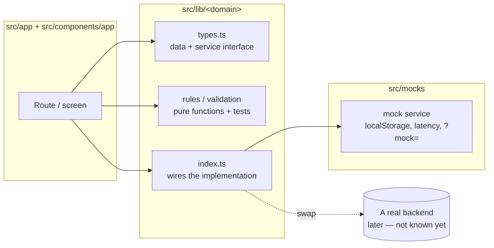

# Architecture

## Layers



- **Screens** import types, rules and the service object from `@/lib/<domain>` only. ESLint
  (`no-restricted-imports`) stops them from importing `@/mocks`.
- **`src/lib/<domain>/index.ts`** is the one place where an implementation is chosen:

  ```ts
  /** The repository the app uses. Swap the mock for a real implementation here. */
  export const discountCodeRepository: DiscountCodeRepository = mockDiscountCodeRepository
  ```

  A real backend means writing a class or object that satisfies the same interface (fetch calls,
  error mapping to the domain error) and changing that one line. Screens don't change.

- **Business rules** — validation, derived statuses, formatting, totals — are pure functions next to
  the types, each with Vitest tests. Screens call them; mocks call them too where a backend would
  enforce the same rule (e.g. a duplicate discount code).
- **Mocks behave like a backend would**: they add latency, return the domain's typed errors, enforce
  rules (a used discount code can't be deleted) and write the audit log. Their state lives in
  `localStorage`, so it survives reloads. See [Mock data](./mock-data.md).

## Domains

| Domain           | Interface                      | Used by                                  | Backend (suggestion)                                           |
| ---------------- | ------------------------------ | ---------------------------------------- | -------------------------------------------------------------- |
| `onboarding`     | `OnboardingService`            | Welcome, setup wizard steps 1–5          | [onboarding](./screens/welcome/setup/backend.md)               |
| `billing`        | `BillingService`               | Welcome: trial bar, plans                | [billing](./screens/welcome/backend.md)                        |
| `discount-codes` | `DiscountCodeRepository`       | Settings → Discount codes                | [discount codes](./screens/settings/discount-codes/backend.md) |
| `session`        | `SessionService` (server only) | admin layout, permission checks          | [session and permissions](./screens/app-shell/backend.md)      |
| `audit-log`      | `AuditLog`                     | written by mocks (Settings → Logs later) | [session and permissions](./screens/app-shell/backend.md)      |
| `tenant`         | — (constants)                  | money and date formatting                | [backend suggestions](./backend.md#money-dates-and-locale)     |

## Rendering

- Routes are server components by default. **Session** is read on the server
  (`sessionService.getSession()` uses cookies): the admin layout gets the user for the sidebar, and
  pages check permissions there (Discount codes).
- **Data** loads on the client: each screen calls its service in an effect and renders `loading`,
  `error` and `ready` states (`aria-busy` while loading). With a real backend this can move to server
  components or a data library — the interfaces stay the same.
- **Forms** keep a _draft_ (text as typed) and turn it into the domain _input_ on save
  (`toDraft` / `toInput`, `toEquipmentDraft` / `toEquipmentInput`). Errors show after the first save
  attempt, then update as you type; focus goes to the first invalid field.

## Layout and navigation

- `src/app/(admin)/layout.tsx` → `AdminShell` (EQ `AppShell`): sidebar from
  `src/config/navigation.tsx`, account menu, "View booking page".
- Sections not built yet are `comingSoon: true` in the navigation — remove the flag when one ships.
- The setup wizard (`/welcome/setup/*`) is full screen, outside the panel shell (`SetupShell`).
- `/booking-page` stands in for the tenant's public booking page, which is a separate site.
