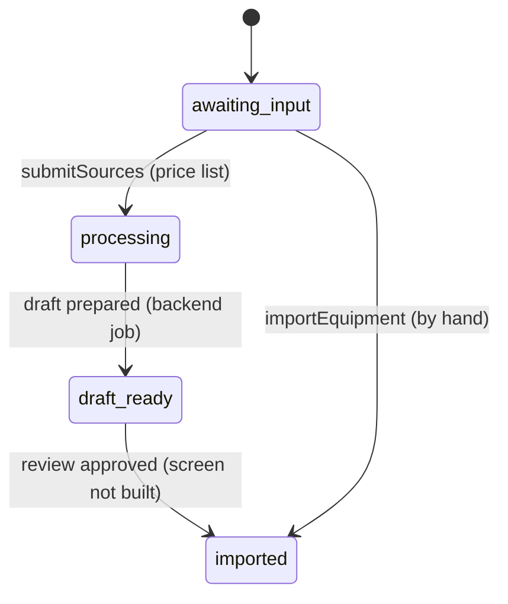

# Onboarding — backend

Interface: `OnboardingService` in `src/lib/onboarding/types.ts`. Mock: `src/mocks/onboarding.ts`
(tests: `onboarding.test.ts`). Screens: [Welcome](../screens/welcome.md) and the setup wizard
([1](../screens/setup-1-sources.md) · [2](../screens/setup-2-progress.md) ·
[3](../screens/setup-3-equipment.md) · [4](../screens/setup-4-settings.md) ·
[5](../screens/setup-5-start.md)).

## The status

`OnboardingStatus` drives Welcome and the wizard:

| Field               | Meaning                                                                                      |
| ------------------- | -------------------------------------------------------------------------------------------- |
| `stage`             | `awaiting_input` (A) → `processing` (B) → `draft_ready` (C) → `imported` (D)                 |
| `account`           | Business name, city, contact email, uploaded price list file name                            |
| `processing`        | When sources were sent, the active processing step, `long` + `readyBy` for large price lists |
| `draft`             | Summary of the prepared draft: categories, units, add-ons, open decisions                    |
| `settings`          | `RentalSettings` — payments, delivery, VAT, card fee, signature                              |
| `settingsDone`      | Step 4 saved with a confirmed VAT rate                                                       |
| `paymentsConnected` | A payment account (Stripe Connect) is connected                                              |

## Operations

| Method                      | Suggested endpoint                       | Rules / errors                                                                                                 |
| --------------------------- | ---------------------------------------- | -------------------------------------------------------------------------------------------------------------- |
| `getStatus()`               | `GET /onboarding`                        | `unavailable`                                                                                                  |
| `submitSources({fileName})` | `POST /onboarding/sources` (file upload) | Starts preparing the draft; stage → `processing`                                                               |
| `listEquipment()`           | `GET /onboarding/equipment`              | Includes the 3 demo items until the customer approves                                                          |
| `addEquipment(input)`       | `POST /onboarding/equipment`             | Validate as `validateEquipment`                                                                                |
| `putEquipment(item)`        | `PUT /onboarding/equipment/{id}`         | Replace; also puts a removed item back (Undo). Saving a demo item makes it the customer's (`demo: false`)      |
| `removeEquipment(id)`       | `DELETE /onboarding/equipment/{id}`      |                                                                                                                |
| `listCustomFields()`        | `GET /custom-fields`                     | The account's fields for descriptions and checkout                                                             |
| `importEquipment()`         | `POST /onboarding/equipment/import`      | Needs ≥ 1 item of the customer's own → `nothing_to_import`; drops demo items and demo data; stage → `imported` |
| `saveSettings(settings)`    | `PUT /onboarding/settings`               | Needs stage `imported` → `not_imported`; `vatConfirmed` → `vat_not_confirmed`; sets `settingsDone`             |
| `connectPayments()`         | Stripe Connect onboarding (redirect)     | Sets `paymentsConnected`                                                                                       |

`OnboardingError.reason`: `unavailable`, `nothing_to_import`, `vat_not_confirmed`, `not_imported`.

## Preparing a draft (B → C)

In the prototype a timer simulates it (`simulatedProgress`: a step every ~1.1 s, ready after ~15 s).
In the product it's a job on the server. The UI needs:

- the current step (`processing.activeStep`, labels from `processingSteps`) — today it **polls**
  `getStatus()`; a push (SSE / websocket) would also work;
- for large price lists `long: true` and `readyBy` (`HH:MM`);
- an email to `account.email` when the draft is ready;
- the draft summary (`draft`), and the draft itself for the review screen (not built yet).

## Equipment

`EquipmentItem` (`src/lib/onboarding/equipment.ts`):

- `name`, `parentCategory?`, `units` (1–999), `codePrefix` (2–6 capitals/digits), `photoUrl?`,
  `pricing`, `unitOverrides?`, `online?`, `demo?`.
- **Unit codes** are `PREFIX-NNN`, numbered on across items with the same prefix
  (`unitsByItem`). A unit may override `code` (2–20: A–Z, 0–9, "-"), `name`, `photoUrl`
  (`unitOverrides`, by position). **Unit codes are unique per tenant.** A unit without its own photo
  uses the item's.
- **Pricing** (`src/lib/onboarding/pricing.ts`): tiers per hour / day / week / month (`from`, `to`
  or `null` = "and more", price), hourly packages (hours, price), a nightly price, and **price rules**
  (date range or weekdays, percent or fixed change, active). `validatePricing` lists every rule
  (no overlapping ranges, at least one rate, …); `applyRules` how rules combine on a date. The
  booking engine must price with the same rules.
- **Booking page** (`src/lib/onboarding/online.ts`): `visible`, `slug` (unique per tenant: the item's
  address `/product/<slug>`), `descriptions` per language (≤ 2000 characters), `descriptionFields`
  and `checkoutFields` (custom field ids). Hidden items aren't listed on the booking page but can
  still be booked in the panel.

## Rental settings

`RentalSettings` with the rules in `validateSettings` (`src/lib/onboarding/settings.ts`): deposit
1–99%, rest charged 0–60 days before pickup, free delivery from 1–365 days, valid fee amounts, card fee
0.01–10%, VAT rate confirmed.
