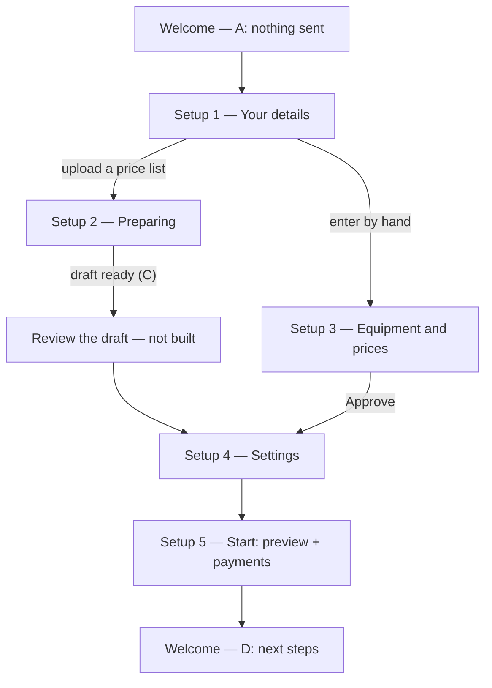

# Screens

One page per screen. New screen → copy [the template](./_template.md), add a row here
(`pnpm lint:docs` checks both).

**Status**: _prototype_ — built and tested on mock data · _stand-in_ — a placeholder for something
outside this app · _planned_ — "Soon" in the sidebar.

| Screen                                                   | Route                      | Status    |
| -------------------------------------------------------- | -------------------------- | --------- |
| [Panel shell and navigation](./app-shell.md)             | every page in the panel    | prototype |
| [Welcome](./welcome.md)                                  | `/welcome` (`/` redirects) | prototype |
| [Setup 1 — Your details](./setup-1-sources.md)           | `/welcome/setup/sources`   | prototype |
| [Setup 2 — Preparing](./setup-2-progress.md)             | `/welcome/setup/progress`  | prototype |
| [Setup 3 — Equipment and prices](./setup-3-equipment.md) | `/welcome/setup/equipment` | prototype |
| [Setup 4 — Settings](./setup-4-settings.md)              | `/welcome/setup/settings`  | prototype |
| [Setup 5 — Start](./setup-5-start.md)                    | `/welcome/setup/start`     | prototype |
| [Settings → Discount codes](./discount-codes.md)         | `/settings/discount-codes` | prototype |
| [Booking page](./booking-page.md)                        | `/booking-page`            | stand-in  |
| [Docs site](./docs-site.md)                              | `/docs/…`                  | prototype |

Planned (sidebar "Soon"): Dashboard, Calendar, Orders, Customers, Equipment, Transport, Service;
Settings → General settings, Users, Roles, Branches, Payments, Tax. The list lives in
`src/config/navigation.tsx`.

## The onboarding flow

Every step can be closed and resumed from Welcome, which always shows the next thing to do.
