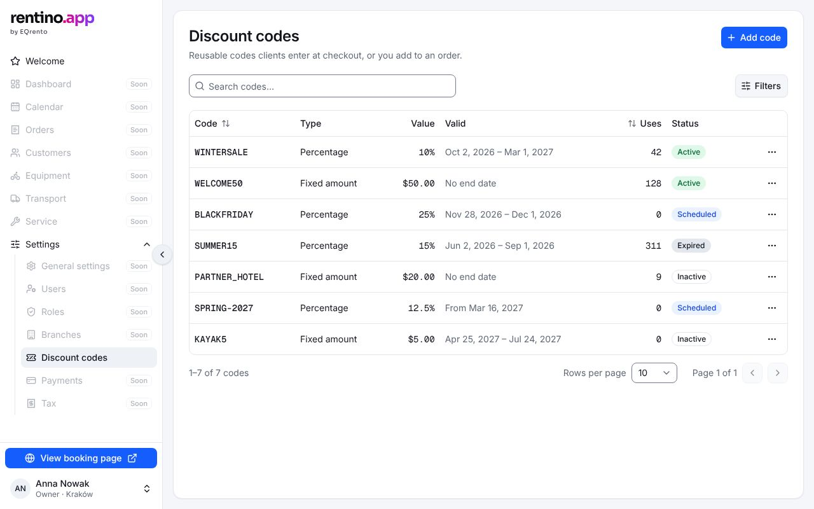

# Panel shell and navigation

The frame around every page inside the panel: the sidebar with the navigation, the booking page
link and the account menu.

## What's in it

- **Sidebar** (EQ `AppShell`): the logo, the navigation from `src/config/navigation.tsx`, then in the
  footer **View booking page** and the **account menu** (name, role · branch; theme, sign out).
- **Navigation**: Welcome, then the product sections. Sections that aren't built have
  `comingSoon: true` and show "Soon" — they're not links. Settings opens a sub-list (Discount codes is
  live).
- **Collapsing**: the sidebar collapses to icons (the choice is kept in the `sidebar_state` cookie).
  On small screens the navigation is a sheet opened from the header.
- **View booking page** opens the public booking page [in a new tab](./booking-page.md), with the
  external-link icon and "(opens in a new tab)" for screen readers.

## Files

- `src/app/(admin)/layout.tsx` — reads the session (server), renders `AdminShell`.
- `src/components/app/admin-shell.tsx`, `sidebar-footer.tsx`, `account-menu.tsx`.
- `src/config/navigation.tsx` — items and the route constants (`WELCOME_HREF`, `DISCOUNT_CODES_HREF`,
  `SETUP_*_HREF`, `BOOKING_PAGE_HREF`). Use the constants, not string paths.

## Adding a section to the navigation

Add (or un-flag) the item in `navigation.tsx`, add the route under `src/app/(admin)/`, then follow
[Adding a screen](../README.md#adding-a-screen).

## Tests

`e2e/keyboard.spec.ts` — focus on every Tab stop, no keyboard trap, the mobile navigation sheet
(focus trapped while open, Escape closes, focus returns), the booking page link. Sidebar collapsed:
axe in `e2e/a11y.spec.ts`.
