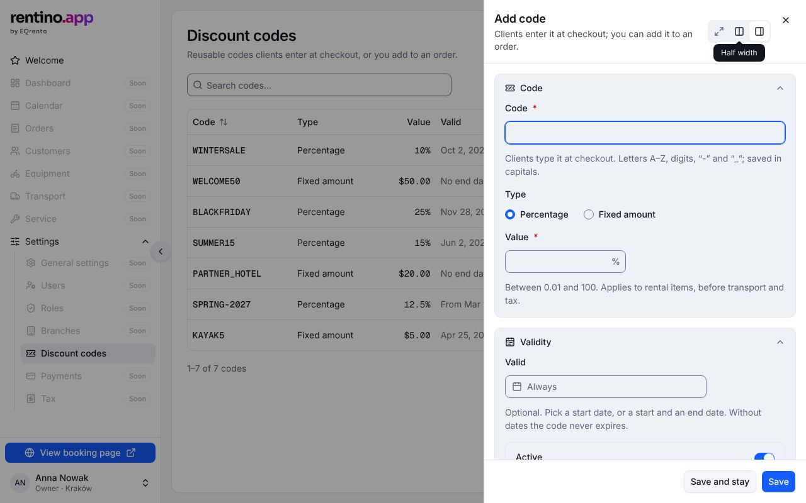
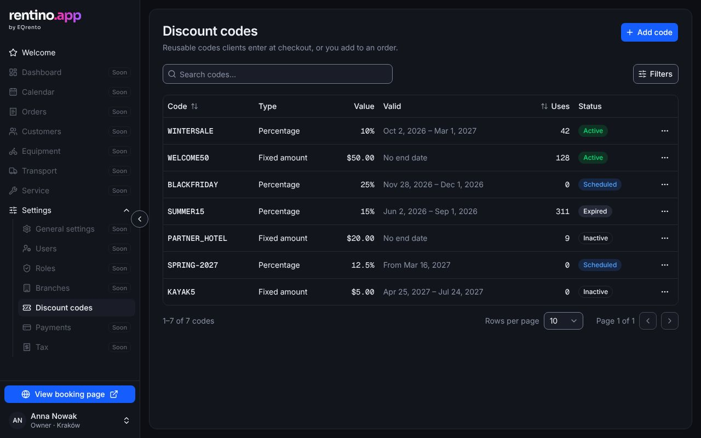
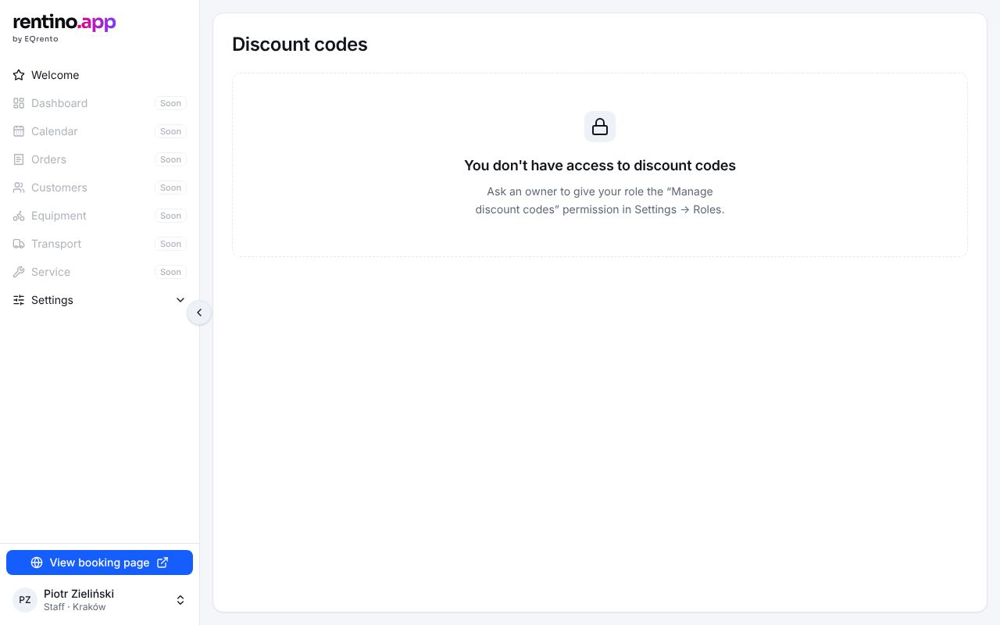

# Settings → Discount codes

Reusable codes clients enter at checkout, or staff add to an order. Jira epic **WHLZ-566** — the first
section of the panel that was built.

## Getting there

Sidebar → Settings → Discount codes. Needs the **Manage discount codes** permission
(`discount_codes.manage`); without it the page says so and how to get it.

## The list

- Columns: **Code** (mono, sortable), **Type** (Percentage / Fixed amount), **Value** ("10%",
  "$50.00"), **Valid** ("Jan 2 – Jun 1, 2027", "From …", "Until …", "No end date"), **Uses**,
  **Status**, row actions.
- **Status** is derived, never stored: _Inactive_ (switched off) › _Scheduled_ (before its start date)
  › _Expired_ (after its end date) › _Active_.
- **Search** (code and internal note, case-insensitive) and **filters** (status, type) with a count
  of active filters and "Clear".

## What the user can do

| Action               | Result                                                                          |
| -------------------- | ------------------------------------------------------------------------------- |
| **Add code**         | Side panel → save → toast "Code X created"                                      |
| Row → **Edit**       | Same panel. A used code's text is read-only ("Clients already used this code…") |
| Row → **Copy code**  | Copies to the clipboard; toast                                                  |
| Row → **Deactivate** | Confirm dialog (orders that used it keep their discount) → toast with Undo      |
| Row → **Activate**   | Immediately, toast with Undo                                                    |
| Row → **Delete**     | Only for codes never used. Confirm dialog ("can't be undone")                   |

**The panel**: Code (A–Z, 0–9, "-", "_"; typed lowercase becomes uppercase), Type, Value, Active;
Validity (optional date range — without dates the code never expires); Internal note (team only).

## States

| State       | How to see it                                                                     | What shows                                      |
| ----------- | --------------------------------------------------------------------------------- | ----------------------------------------------- |
| Ready       | `/settings/discount-codes`                                                        | 7 demo codes, one of each status                |
| Empty       | `?mock=empty`                                                                     | "No discount codes yet" + Add code              |
| No matches  | search for something that isn't there                                             | "No codes match" + Clear search and filters     |
| Error       | `?mock=error`                                                                     | "Discount codes couldn't be loaded" + Try again |
| No access   | cookie `mock_user=staff` ([how](../mock-data.md#demo-users-the-mock_user-cookie)) | Lock + who to ask                               |
| Dark, 320px | system dark mode / narrow window                                                  |          |

## Rules and validation

- `src/lib/discount-codes/validation.ts` → `validateDiscountCode` (code: required, pattern, ≤ 32
  characters, unique case-insensitive; value: percentage 0.01–100, amount > 0, ≤ 2 decimals; end date
  not before start date), `normalizeCode`, `parseAmount` (accepts "12,5" and "12.5"), `toDraft` /
  `toInput` (tests: `validation.test.ts`).
- `src/lib/discount-codes/rules.ts` → `statusOf`, `canDelete`, `formatValue`, `formatValidity`,
  `matchesQuery` (tests: `rules.test.ts`).
- The mock enforces what the backend must: duplicate codes, a used code can't change its text or be
  deleted (tests: `src/mocks/discount-codes.test.ts`). Every change writes an audit entry.

## Data

`discountCodeRepository`: `list`, `create`, `update`, `setActive`, `remove`. Errors are
`DiscountCodeError` with a reason (`not_found`, `in_use`, `duplicate_code`, `unavailable`) and a
message shown to the user. See [discount codes backend](../backend/discount-codes.md).

## Components

- EQ: `PageHeader`, `Toolbar` (`ToolbarSearch`, `FilterToggle`, `FilterPanel`, `FilterField`), `DataTable`,
  `StatusBadge` (`domain="discountCode"`), `DropdownMenu`, `EditPanel`, `FormField`,
  `DateRangePicker`, `ConfirmDialog`, `EmptyState`, `toast`.
- App: `src/components/app/discount-codes/discount-codes-view.tsx`, `discount-code-panel.tsx`,
  `row-actions.tsx`, `filter-select.tsx`; the permission check in
  `src/app/(admin)/settings/discount-codes/page.tsx`.

## Accessibility

- Row actions menu is named per row ("Actions for WINTERSALE").
- Destructive actions go through `ConfirmDialog`; reversible ones get a toast with Undo.

## Tests

`e2e/discount-codes.spec.ts` (list, search, filters, actions, permissions, states),
`e2e/discount-code-form.spec.ts` (the panel and its validation).
