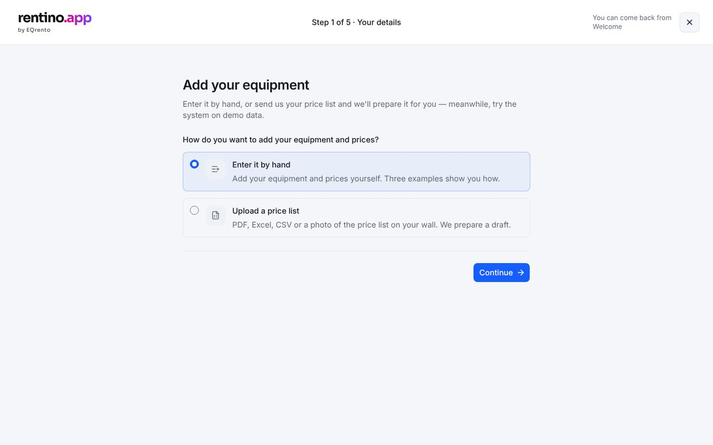

# Setup 1 — Your details

The customer chooses how to add their equipment: **enter it by hand**, or **upload a price list** we
turn into a draft.

## Getting there

Welcome A → "Add equipment". The wizard is full screen (`SetupShell`): "Step 1 of 5 · Your details",
and a close button back to Welcome.

## What the user can do

- **Enter by hand** → continue to [Setup 3](./setup-3-equipment.md).
- **Upload a price list** → choose a file (`Input type="file"`; a dropzone isn't in EQ yet), see its
  name and size, remove it → send → [Setup 2](./setup-2-progress.md). The stage becomes B
  (`processing`).

## Rules and validation

`src/lib/onboarding/rules.ts` → `sourcesError` ("Add your price list file." when the file option has
no file), `formatFileSize` (tests: `rules.test.ts`).

## Data

`onboardingService.submitSources({ fileName })` — only the file name is sent; the mock simulates the
preparation. A real backend uploads the file — see [onboarding](../backend/onboarding.md).

## Components

- EQ: `RadioGroup`, `FormField`, `Input`, `IconButton` ("Remove file"), `Button` (loading state).
- App: `src/components/app/setup/sources-step.tsx`, `setup-shell.tsx`.

## Tests

`e2e/setup.spec.ts`.
