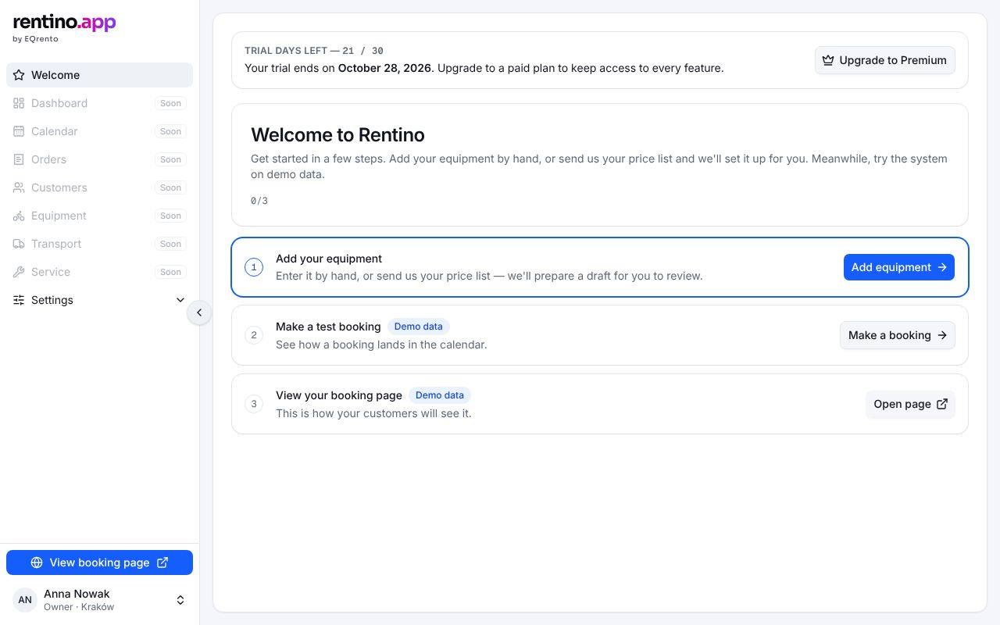
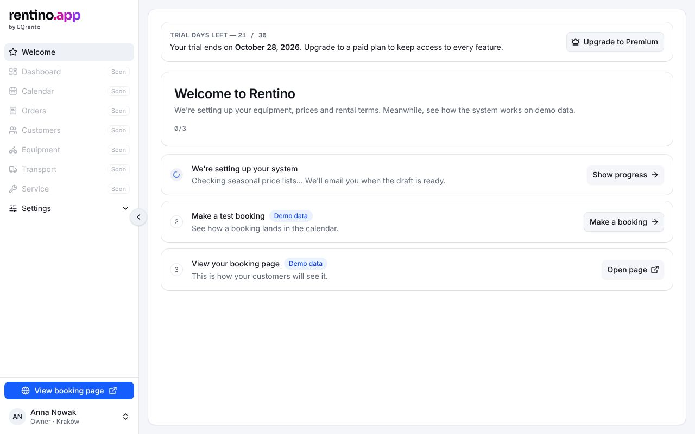
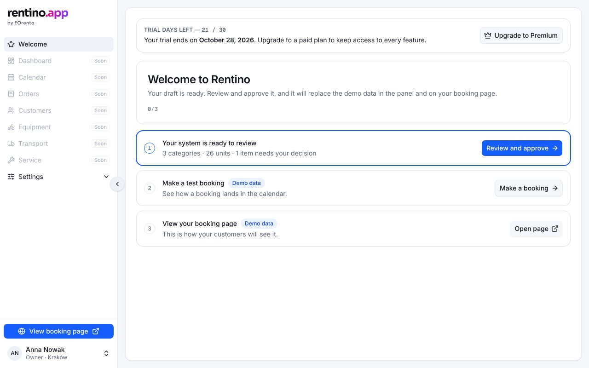
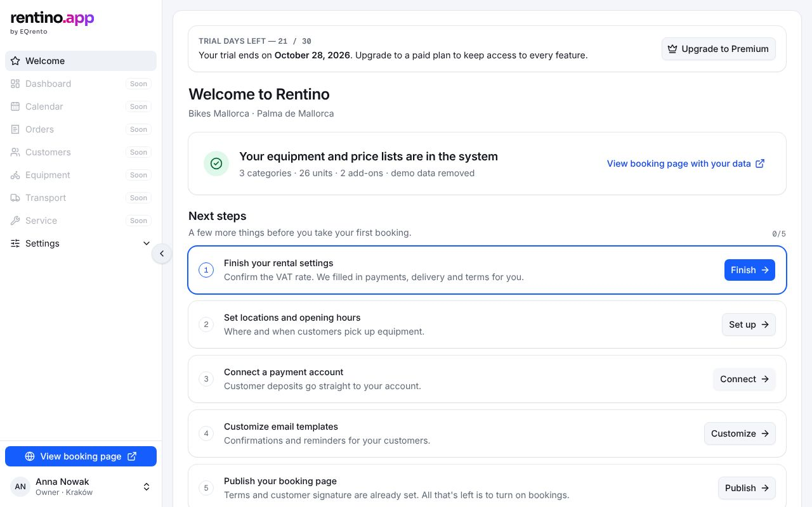
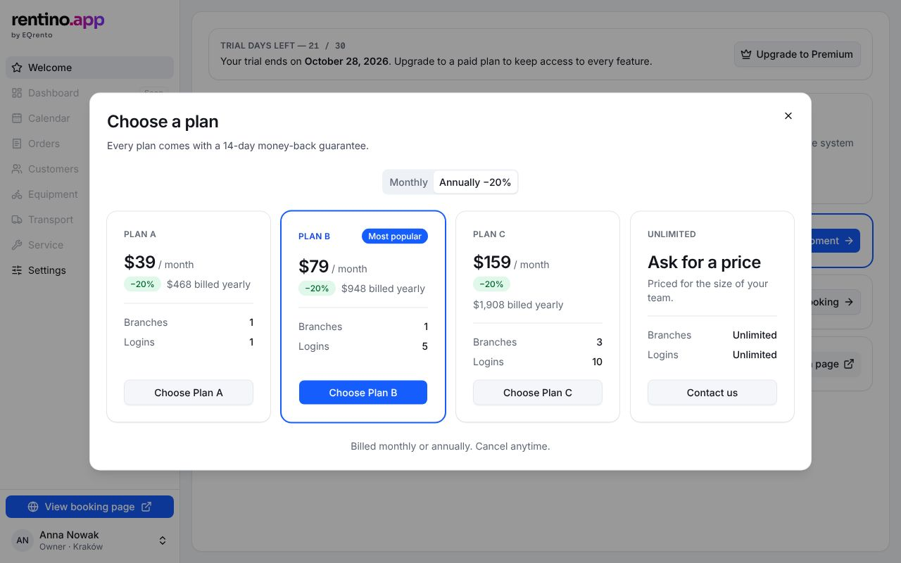

# Welcome

The first page of a new rental business: a checklist that always shows the next thing to do, while
the panel runs on demo data. `/` redirects here. Its steps lead into the
[setup wizard](./setup/README.md).

## States (onboarding stage A–D)

The page follows `OnboardingStatus.stage`.

| State  | How to see it                   | What shows                                                                                                                                    |
| ------ | ------------------------------- | --------------------------------------------------------------------------------------------------------------------------------------------- |
| A      | `/welcome` (new visitor)        | Intro, steps: **Add your equipment** (highlighted), Make a test booking, View your booking page (both on demo data)                           |
| B      | `/welcome?mock=processing`      | "We're setting up your system" with the current processing step and a spinner → Setup 2                                                       |
| B long | `/welcome?mock=processing-long` | As B, with "ready by HH:MM" — a large price list takes hours                                                                                  |
| C      | `/welcome?mock=draft-ready`     | "Your system is ready to review" (highlighted) — the review isn't built yet                                                                   |
| D      | `/welcome?mock=imported`        | Success card ("View booking page with your data", new tab) and **Next steps**: finish settings, locations, payments, email templates, publish |
| D done | `/welcome?mock=imported-paid`   | Next steps without settings and payments                                                                                                      |
| Error  | `/welcome?mock=error`           | Alert with "Try again"                                                                                                                        |

| B                             | C                             | D                             |
| ----------------------------- | ----------------------------- | ----------------------------- |
|  |  |  |

### Trial bar and plans

Above the checklist while no paid plan is chosen: days left of the 30-day trial and **Upgrade to
Premium**, which opens the **Choose a plan** dialog (monthly / annual, annual −20%).

| State         | How to see it                |
| ------------- | ---------------------------- |
| Trial running | `/welcome` (21 days left)    |
| Ending        | `/welcome?mock=trial-ending` |
| Ended         | `/welcome?mock=trial-ended`  |

## What the user can do

- Each step has one button. Steps with a screen link to it (`HREFS` in `welcome-view.tsx`): Add
  equipment → Setup 1, Show progress → Setup 2, Finish → Setup 4, Connect → Setup 5, Open page → the
  booking page in a new tab. The rest show a "Coming soon" toast.
- Exactly one step is **highlighted** (primary button): the next thing to do.
- Choosing a plan in the dialog hides the trial bar (simulated checkout).

## Rules

- Steps, intro and titles per stage: `src/lib/onboarding/rules.ts` → `welcomeSteps`, `nextSteps`,
  `welcomeIntro`, `importedTitle`, `importedSummary` (tests: `rules.test.ts`).
- Trial and prices: `src/lib/billing/rules.ts` → `trialStatus`, `showsTrial`, `monthlyPrice`,
  `annualTotal`, `PLANS` (tests: `rules.test.ts`). Prices are placeholders — see
  [Decisions](../../decisions.md#open).

## Data

`onboardingService.getStatus()` on load; `billingService.getSubscription()` for the trial bar,
`choosePlan()` from the dialog. See [onboarding](../../backend/onboarding.md) and
[billing](../../backend/billing.md).

## Components

- EQ: `Card`, `Badge`, `Button`, `Alert`, `Spinner`, `Dialog`, `ToggleGroup` (billing period).
- App: `src/components/app/welcome/welcome-view.tsx`, `step-card.tsx` (`StepCard`, `StepCounter`),
  `src/components/app/billing/trial-bar.tsx`, `plans-dialog.tsx`.

## Accessibility

- Each step's button is described by the step title (`aria-describedby`), so "Open page" is
  announced with "View your booking page".
- The counter reads "0 of 3 steps done" to screen readers ("0/3" on screen).
- The plans dialog gets its own axe run.

## Tests

`e2e/welcome.spec.ts` (states A–D, actions, errors), `e2e/trial.spec.ts` (trial bar, plans dialog).
