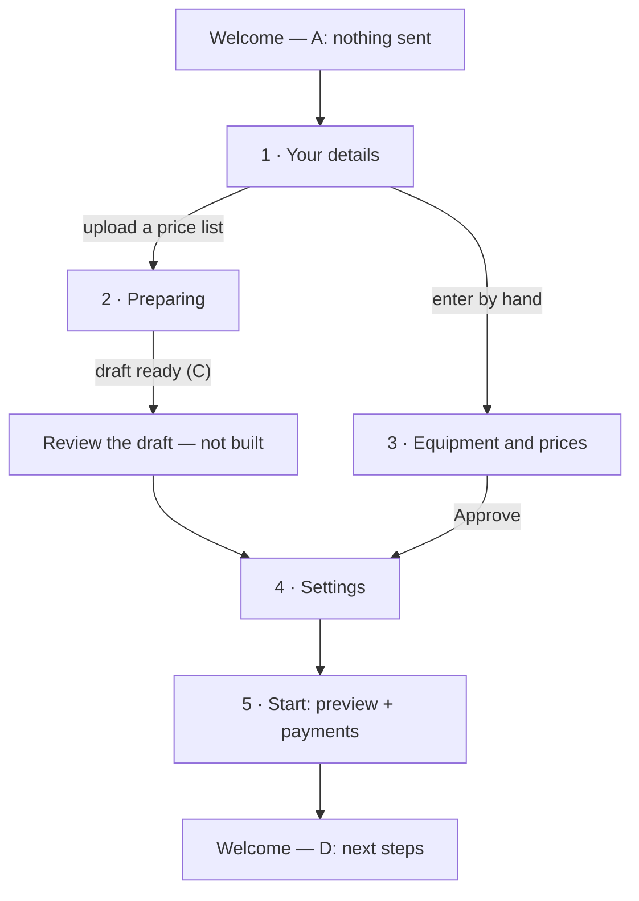

# Setup wizard

Five full-screen steps that take a new rental business from demo data to its own equipment, terms
and payments. It runs outside the panel shell (`SetupShell`: "Step N of 5 · Name" and a close button
back to [Welcome](../README.md)); every step can be left and resumed from Welcome.

| Step                                       | Route                      |
| ------------------------------------------ | -------------------------- |
| [1 · Your details](./sources.md)           | `/welcome/setup/sources`   |
| [2 · Preparing](./progress.md)             | `/welcome/setup/progress`  |
| [3 · Equipment and prices](./equipment.md) | `/welcome/setup/equipment` |
| [4 · Settings](./settings.md)              | `/welcome/setup/settings`  |
| [5 · Start](./start.md)                    | `/welcome/setup/start`     |

## The flow

1. **Your details** — enter equipment by hand, or upload a price list.
2. **Preparing** — only for a price list: we turn it into a draft; Welcome C offers the review (not
   built yet).
3. **Equipment and prices** — by hand: items, units, price lists, booking page settings.
4. **Settings** — payments, delivery, VAT, booking page terms.
5. **Start** — the booking page preview and connecting payments.

Files: `src/app/welcome/setup/*/page.tsx`, `src/components/app/setup/`.
