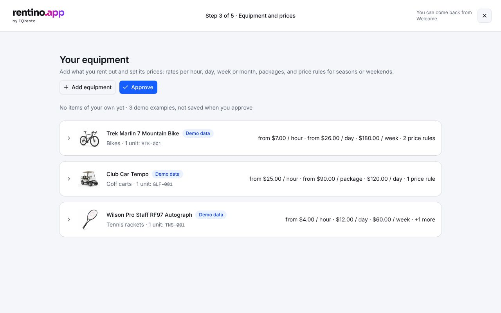
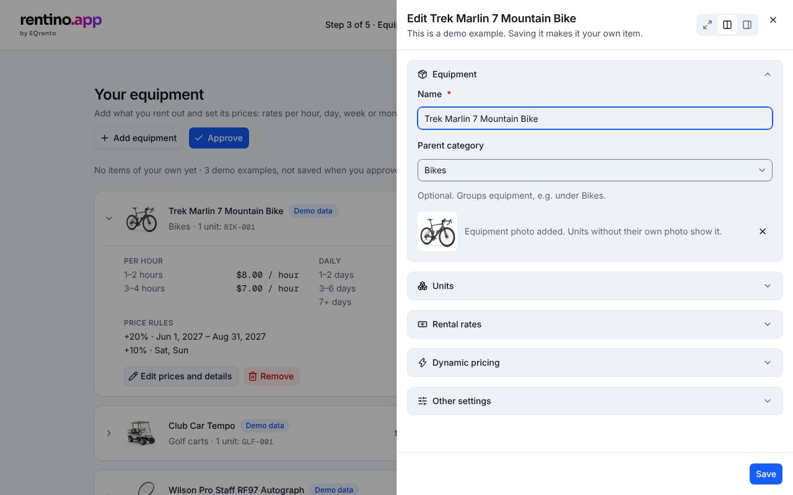
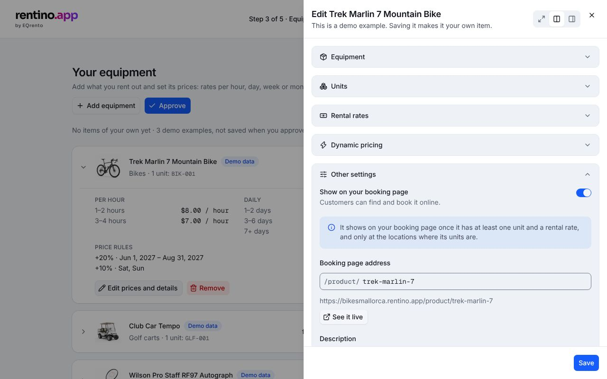
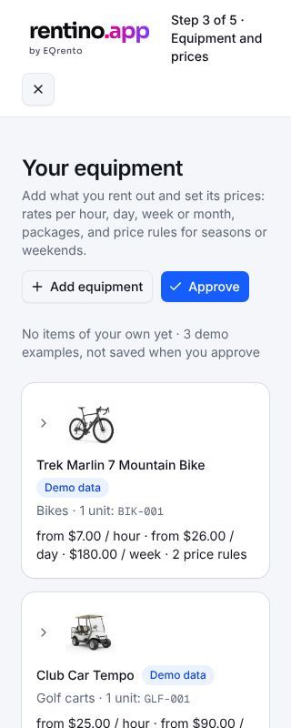

# Setup 3 — Equipment and prices

The customer adds what they rent out — by hand — with units, full price lists and booking page
settings. It looks like the review of a prepared draft: one row per item, edited in a side panel.

## Getting there

Setup 1 → "Enter it by hand". **Approve** leads to [Setup 4](./settings.md).

## The list

- One collapsible row per item (**all start collapsed**): photo, name, "Demo data" / "Hidden
  online" badges, parent category (when set), number of units and their codes, a price summary
  (e.g. "from $7.00 / hour · from $26.00 / day · 2 price rules").
- Opened: the full price list (read-only), units with their own details, **Edit prices and
  details**, **Remove** (toast with Undo).
- A line above the list: items of the customer's own, units, and demo examples.
- **Three demo items** (Trek Marlin 7, Club Car Tempo, Wilson Pro Staff RF97) show what a finished
  item looks like. They're never saved by approving; editing one makes it the customer's own.

## The side panel (`EditPanel`)

Sections — **only the first starts open**; a save with errors opens every section that has one and
moves focus to the first invalid field.

| Section             | Fields                                                                                                           |
| ------------------- | ---------------------------------------------------------------------------------------------------------------- |
| **Equipment**       | Name (required), Parent category (optional, "None"), Photo (JPG/PNG/WebP, ≤ 1 MB)                                |
| **Units**           | Number of units (1–999), Code prefix (defaults to the first five letters of the name), the list of units         |
| **Rental rates**    | Tabs: Per hour, Hourly packages, Daily, Nightly, Weekly, Monthly — ranges ("1–2 days: $35 / day") or packages    |
| **Dynamic pricing** | Rules: date range or days of the week, + / − percent or fixed amount, active on/off                              |
| **Other settings**  | Show on the booking page, booking page address, description per language, custom description and checkout fields |

### Units

Each unit gets a code: prefix + number (`TREKM-001`). Numbers continue across items with the same
prefix. A unit can override its **code** (e.g. a frame number), **name** ("Size L, red") and
**photo**; without its own photo it shows the equipment photo. The list shows 10 units, then
"Show all N units". A unit with an error opens by itself.

### Other settings

From Rentino's "online booking settings":

- **Show on your booking page** — off: hidden online, still bookable in the panel; the list marks it
  "Hidden online" and step 5 leaves it out of the preview.
- **Booking page address** — `/product/<slug>`; the slug follows the name until edited, must be
  unique. The full URL is shown under the field. Saved items get **See it live** (new tab).
- **Description** — one tab per language (EN, PL, ES, DE, FR, NL, PT, IT, SV, AR, SR); a dot marks a
  language with text. Visitors see their language, or English.
- **Custom description fields / checkout fields** — pick any of the account's custom fields. The
  pencil will open their management in Settings (not built).

## States

| State                          | How to see it                                     |
| ------------------------------ | ------------------------------------------------- |
| Ready                          | `/welcome/setup/equipment`                        |
| Empty                          | remove the demo items                             |
| Nothing of your own to approve | "Approve" with only demo items → warning          |
| 320 px                         |  |

## Rules and validation

All in `src/lib/onboarding/` with tests next to them:

- `equipment.ts` — `validateEquipment` (name, units, prefix, unit codes unique within the item and
  across items, slug), `renameDraft` (prefix and slug follow the name), `unitsOf` / `draftUnits` /
  `unitsByItem` (codes, overrides, photo fallback), `toEquipmentInput`, `equipmentTotals`.
- `pricing.ts` — `validatePricing` (ranges must not overlap, an empty "to" means "and more"; at least
  one rate; rules need a change and dates or days), `applyRules` (how rules add up on a date),
  `pricingSummary`, `startingPrice`.
- `online.ts` — `slugify`, `prefixFromName`, `validateOnline`, `toOnline`, `isOnline`.

## Data

`listEquipment`, `addEquipment`, `putEquipment` (save, undo), `removeEquipment`, `listCustomFields`,
`getStatus` (for the booking page address), `importEquipment` (Approve). See
[backend suggestion](./backend.md).

## Components

- EQ: `PageHeader`, `Collapsible`, `Card`, `Badge`, `EditPanel` (+ `EditPanelSection`,
  `EditPanelFields`), `FormField`, `Input`, `Select` (single and multiple), `Tabs`, `Switch`,
  `Textarea`, `InputGroup`, `ToggleGroup` (weekdays), `DateRangePicker`, `Alert`, `ConfirmDialog`,
  `EmptyState`, `IconButton`.
- App: `src/components/app/setup/equipment-step.tsx`, `equipment-panel.tsx`, `unit-list.tsx`,
  `pricing-editor.tsx`, `pricing-breakdown.tsx`, `online-settings.tsx`.

## Accessibility

- Errors in hidden places (collapsed section, another rate tab, a unit) open them before focus moves.
- A rate tab or language tab with errors says so ("…, has errors").
- Unit rows are named by their code ("Unit TREKM-002"); the description textareas carry `lang`
  (Arabic is right to left).

## Tests

`e2e/equipment.spec.ts` — demo items, the panel, price lists, units, other settings, approve, axe on
every overlay in both themes.
