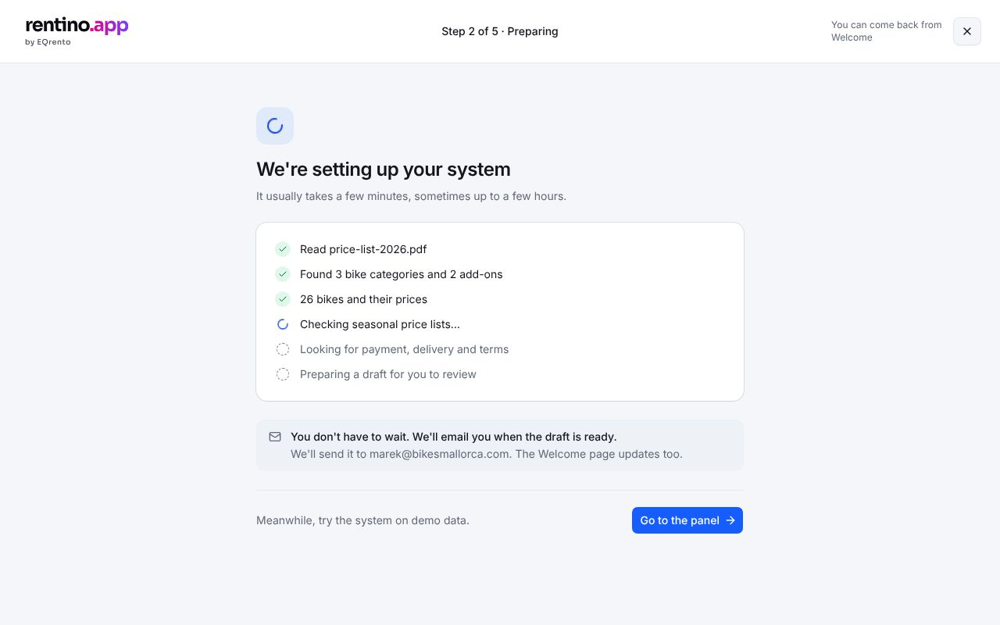

# Setup 2 — Preparing

While we turn the customer's price list into a draft: what's done, what's in progress, and when it
will be ready.

## States

| State       | How to see it                                         | What shows                                                                          |
| ----------- | ----------------------------------------------------- | ----------------------------------------------------------------------------------- |
| Preparing   | after sending a file in step 1, or `?mock=processing` | List of steps: done / in progress (spinner) / pending                               |
| Long        | `?mock=processing-long`                               | "Ready by HH:MM"; we email the customer                                             |
| Draft ready | `?mock=draft-ready`                                   | "Your draft is ready" with its summary (categories, units, add-ons, open decisions) |
| Not started | `/welcome/setup/progress` in state A                  | Redirects to step 1                                                                 |

The status refreshes on its own while preparing (polling). The customer doesn't have to wait: we
email them when the draft is ready, and Welcome shows it too.

## Rules

`src/lib/onboarding/rules.ts` → `processingSteps`, `processingRows`, `activeProcessingLabel`,
`draftReadySummary` (tests: `rules.test.ts`). Simulated timing: `simulatedProgress` in the mock.

## Data

`onboardingService.getStatus()`, polled. A real backend could perhaps push progress instead (see
[backend suggestion](./backend.md)).

## Components

- EQ: `Card`, `Spinner`, `Alert`, `Skeleton`.
- App: `src/components/app/setup/progress-step.tsx`.

## Open questions

The draft review ("Review and approve") isn't built — [Decisions](../../../decisions.md#open).

## Tests

`e2e/setup.spec.ts`.
