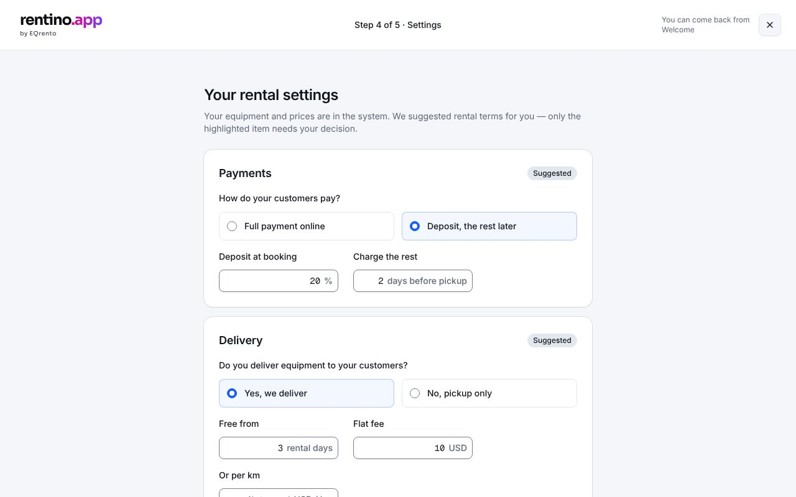

# Setup 4 — Settings

The rental terms, prefilled with suggested values the customer confirms or changes.

## Getting there

After approving equipment in step 3, or Welcome D → "Finish your rental settings". **Save and
continue** → [Setup 5](./start.md); **I'll finish later** → Welcome.

## Sections

| Tile               | What                                                                                        |
| ------------------ | ------------------------------------------------------------------------------------------- |
| **Payments**       | Full payment online, or a deposit (1–99%) with the rest charged N days (0–60) before pickup |
| **Delivery**       | On/off; free from N rental days (1–365), flat fee, optional price per km                    |
| **Taxes and fees** | VAT rate and country — **must be confirmed every time**; optional card fee (0.01–10%)       |
| **Booking page**   | Rentino standard rental terms; customer signature at booking (recommended)                  |

Hidden fields (e.g. deposit when paying in full) keep their last saved values.

## States

| State         | How to see it                                                   |
| ------------- | --------------------------------------------------------------- |
| Ready         | `/welcome/setup/settings?mock=imported`                         |
| Before import | `/welcome/setup/settings` (state A): "Add your equipment first" |
| Error         | `/welcome/setup/settings?mock=error`                            |

## Rules and validation

`src/lib/onboarding/settings.ts` → `validateSettings`, `toSettingsDraft`, `toSettings`, `vatLabel`,
`settingsSummary` (tests: `settings.test.ts`). Saving without a confirmed VAT rate also fails in the
service (`vat_not_confirmed`).

## Data

`getStatus()` (current settings), `saveSettings(settings)` — needs stage `imported` and a confirmed VAT
rate; marks settings done. See [onboarding](../../../backend/onboarding.md).

## Components

- EQ: `Card`, `RadioGroup` (a segmented control isn't in EQ), `Field`, `FormField`, `InputGroup`,
  `Checkbox`, `Switch`, `Separator`, `Badge` ("Suggested"), `Alert`.
- App: `src/components/app/setup/settings-step.tsx`, `equipment-first.tsx`.

## Tests

`e2e/settings.spec.ts`.
