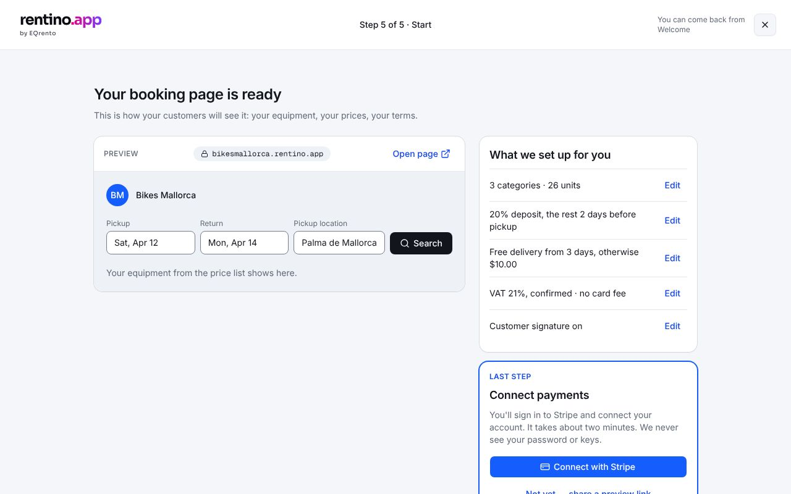

# Setup 5 — Start

The booking page is ready: a preview with the customer's own equipment and prices, a summary of
what we set up (each with a way back to change it), and the last step — connect payments.

## What's on it

- **Preview of your booking page** — a picture, not a working form: the address
  (`<business>.rentino.app`), the search bar, the customer's items that are **shown online**
  (demo items and hidden items are left out) with photo and starting price. **Open page** opens the
  booking page in a new tab.
- **What we set up for you** — equipment totals and one row per settings area, each with **Edit**
  (back to step 3 or 4).
- **Last step: Connect payments** — **Connect with Stripe** (simulated) → Welcome with a toast;
  **Not yet — share a preview link** copies the address and goes to Welcome.

## States

| State              | How to see it                                                |
| ------------------ | ------------------------------------------------------------ |
| Ready              | `/welcome/setup/start?mock=imported-settings`                |
| Payments connected | `/welcome/setup/start?mock=imported-paid`                    |
| Before import      | `/welcome/setup/start` (state A): "Add your equipment first" |
| Error              | `/welcome/setup/start?mock=error`                            |

## Rules

`src/lib/onboarding/start.ts` → `bookingDomain`, `bookingPreviewItems`, `setupRows`, `initials`
(tests: `start.test.ts`).

## Data

`getStatus()`, `listEquipment()`, `connectPayments()`. See [backend suggestion](./backend.md) —
in the product, Stripe Connect would presumably be a backend + redirect flow (a suggestion — the real
integration isn't known).

## Components

- EQ: `Card`, `Alert`, `Button`, `Skeleton`, `toast`.
- App: `src/components/app/setup/start-step.tsx`.

## Tests

`e2e/start.spec.ts`.
